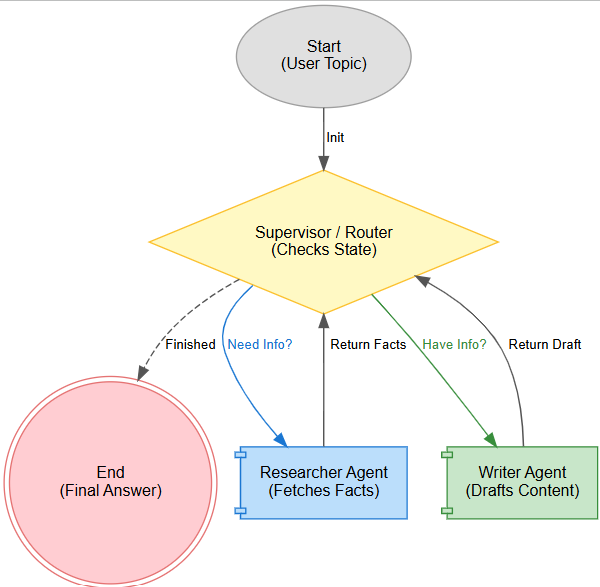

# 🤖 LangGraph Multi-Agent Research Team


A sophisticated multi-agent system built with **LangGraph** that orchestrates a research and writing team. This project demonstrates state-of-the-art agentic workflows, featuring a central Supervisor node that coordinates specialized agents (Data Analyst & Content Author) with persistent memory and conditional logic loops.

---

## 📸 System Architecture

This system utilizes a **Hub-and-Spoke** architecture where a Supervisor node directs the flow of execution based on the conversation state.



---

## ✨ Key Features

This project implements core Agentic AI concepts:

* **👥 Specialized Agents:**
    * **Data Analyst:** Responsible for querying external APIs to fetch factual data and key points.
    * **Content Author:** Responsible for synthesizing the analyst's reports into polished, human-readable prose.
* **🧠 Supervisor Router:** A central "brain" node that analyzes the conversation history to decide the next step dynamically (Analyst $\to$ Author $\to$ End).
* **💾 Memory Persistence:** Uses `MemorySaver` to retain state across steps, allowing agents to "remember" previous outputs within the thread.
* **🔄 Conditional Logic Loops:** Implements logic gates that prevent infinite loops and ensure the task moves forward (e.g., *If Report exists $\to$ Write Draft*).
* **🛡️ Safety Mechanisms:** Includes a built-in step tracker to prevent infinite execution loops, forcing a stop after a set number of iterations.

---

## 🛠️ Tech Stack

* **Language:** Python
* **Orchestration:** [LangGraph](https://github.com/langchain-ai/langgraph)
* **LLM Interface:** OpenRouter API (compatible with Mistral, Liquid, Llama, etc.)
* **Network Requests:** Standard `requests` library (No heavy LangChain model wrappers used for API calls).
* **Visualization:** Graphviz (for architecture generation).

---

## 🚀 Installation & Setup

1.  **Clone the Repository**
    ```bash
    git clone [https://github.com/yourusername/langgraph-agent-team.git](https://github.com/yourusername/langgraph-agent-team.git)
    cd langgraph-agent-team
    ```

2.  **Install Dependencies**
    ```bash
    pip install langgraph langchain-core requests graphviz
    ```

3.  **API Configuration**
    You need an **OpenRouter API Key** to run the agents.
    * The script is designed to ask for the key securely at runtime if not found in the environment.
    * *Optional:* Set it in your environment:
        ```bash
        export OPENROUTER_API_KEY="sk-or-..."
        ```
4. **📝 Example Execution Log**
  * Here is a log from a successful run on the topic **"What is MLOps?"**:
---
🚀 Starting System with Topic: What is mlops

- MANAGER EVALUATING (Iteration 1) ---
   [Analyst] Processing step 1...
   
- MANAGER EVALUATING (Iteration 2) ---
   [Author] Drafting content...
   
- MANAGER EVALUATING (Iteration 3) ---
   [Manager] Task Complete.


**FINAL OUTPUT**

FINAL_DRAFT: Here are three key facts about **MLOps** (Machine Learning Operations):

1. **Definition and Purpose**:
   MLOps is a set of practices that combines **Machine Learning (ML)**, **DevOps**, and **Data Engineering** to streamline the deployment, monitoring, and maintenance of ML models in production. Its goal is to improve collaboration between data scientists, engineers, and operations teams while ensuring reliability, scalability, and efficiency in ML workflows.

2. **Core Components**:
   MLOps encompasses several key components, including:
   - **Version Control** (for code, data, and models),
   - **Automated Pipelines** (CI/CD for ML),
   - **Model Monitoring & Retraining** (to handle drift and performance degradation),
   - **Infrastructure as Code (IaC)** (for scalable deployments),
   - **Governance & Compliance** (for ethical and regulatory adherence).

3. **Business Impact**:
   MLOps helps organizations **reduce time-to-market** for ML models, **minimize failures** in production, and **optimize resource usage**. Companies like Google, Uber, and Netflix use MLOps to deploy and manage ML models at scale, improving everything from recommendation systems to fraud detection.

Would you like a deeper dive into any specific aspect of MLOps?

---

## 💻 Usage

Run the main script to start the agent team:

```bash
python agent_team.ipynb
